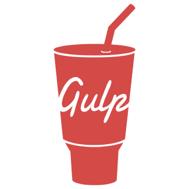

# Hello, this is gulp_multitool!
## **[EN]**
<!-- Ctrl + Shift + V => live view this file in VS Code -->

There is a lot of routine work in website development. Each developer does this in his own way, each creates his own gulp solution.
I decided to make my assembly as reliable, thoughtful and rich in functionality as possible.

**Gulp**, **ts-scripts**, **ready elements, modules**, **snippets** and much more.

### Can i see how it works?
Of course, just check out [this site on githubpages].

### Get started? 
See the [wiki].
You will also find the user manual there.

---

## **[RU]**
В разработке сайтов много рутинной работы. Каждый разработчик решает её по-своему, каждый создает свой gulp-проект.
Я создал свою сборку, сделав её максимально надежной, продуманной и богатой по функционалу.

**Gulp**, **Typescript**, **готовые блоки, модули и элементы**, **сниппеты** а так же многое другое.

### А можно посмотреть?
Конечно, можно взглянуть на функционал зайдя на [этот сайт на githubpages].

### А как сим пользоваться? 
Глянь [вики].
Там же ты найдёшь инструкции по использованию.

[this site on githubpages]: https://ulyanov-programmer.github.io/Default_Project/Default_Project
[этот сайт на githubpages]: https://ulyanov-programmer.github.io/Default_Project/Default_Project
[wiki]: https://github.com/Ulyanov-programmer/Default_Project/wiki
[вики]: https://github.com/Ulyanov-programmer/Default_Project/wiki

---
---

### The following technologies were used:

 

### ...and packages:
- browser-sync - 2.27.9
- chokidar - 3.5.3
- del - 6.0.0
- fs-extra - 10.0.0
- gulp - 4.0.2
- gulp-autoprefixer - 8.0.0
- gulp-changed - 4.0.3
- gulp-clean-css - 4.3.0
- gulp-file-include - 2.3.0
- gulp-group-css-media-queries - 1.2.2
- gulp-html-img-to-picture - 1.0.2
- gulp-if - 3.0.0
- gulp-imagemin - 8.0.0
- gulp-libsquoosh - 1.1.2
- gulp-plumber - 1.2.1
- gulp-rename - 2.0.0
- gulp-stylus - 2.7.1
- gulp-terser - 2.1.0
- gulp-ttf2woff2 - 4.0.1
- gulp-typescript - 6.0.0-alpha.1
- readline-sync - 1.4.10
- replace-in-file - 6.3.2
- typescript - 4.6.3
- uuid - 8.3.2
